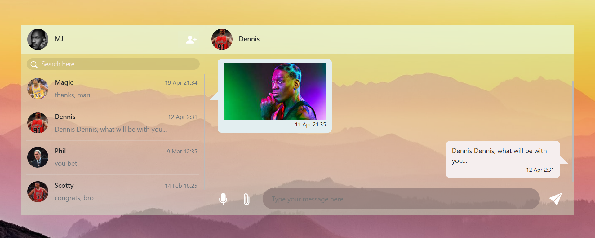

# CatchApp

A React application that allows two people to chat with each other using the internet. This project was bootstrapped with [Create React App](https://github.com/facebook/create-react-app). 

## instillation

To run the app, you need to install npm. In your project directory run:

### `npm install`

after the installation, in your project directory, you need to run:

### `npm start`

This will run the app in the development mode.\
Open [http://localhost:3000](http://localhost:3000) to view it in your browser.

The packages we used to create the app are: 'react-bootstrap', 'react-router-dom'.

## CatchApp usage
The home page of the app is the Sign-in page. If you are an existing user, you just need to type your username and your password to log in. If you are a new user, you will need to go to the Sign-Up page and enter your details in order to create a new account.

  

  

                                 
The existing users are:
- Username: Michael Jordan, Password: MJ123456
- Username: Scotty Pippen, Password: SP123456
- Username: Dennis Rodman, Password: DR123456
- Username: Jerry Krause, Password: JK123456
- Username: John Paxson, Password: JP123456
- Username: Earvin Johnson, Password: EJ123456
- Username: Larry Bird, Password: LB123456
- Username: Phil Jackson, Password: PJ123456

At the Michael Jordan account, you can find chats with all the requested types of messages in the assignment (picture, video and recording).

After successful login, the chat page will appear to the user. At the left side, the user will see his contacts. By pressing the person with the plus icon, the user may add new contacts. Pressing a contact will make the chat appear in the right side of the page. At the right side of the page, at the bottom bar, appears the different types of messages the user can send.
At this moment, CatchApp allows sending messages of several types:

* Regular text message
* Picture
* Video
* Audio recording from the device

To send a regular message, just enter your text in the input field and press enter or press the right plane icon. If you will press the clip icon, two different icons will appear: pressing the image icon will allow to choose an image type file and send it. pressing the video icon will allow to choose a video type file and send it. Pressing the mic icon will allow to record from the device and send the recording. 

  

## Collaborators
Developed by Bar Tawil and Anastasia Khizgiyaev.

